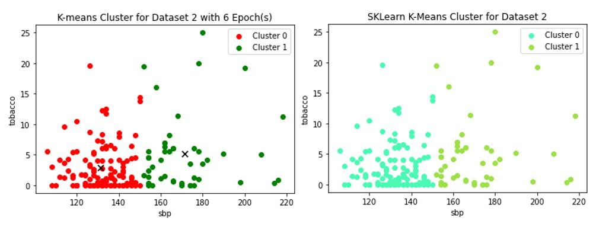
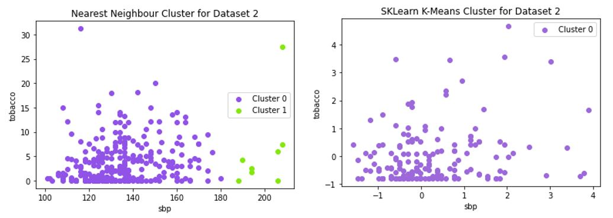
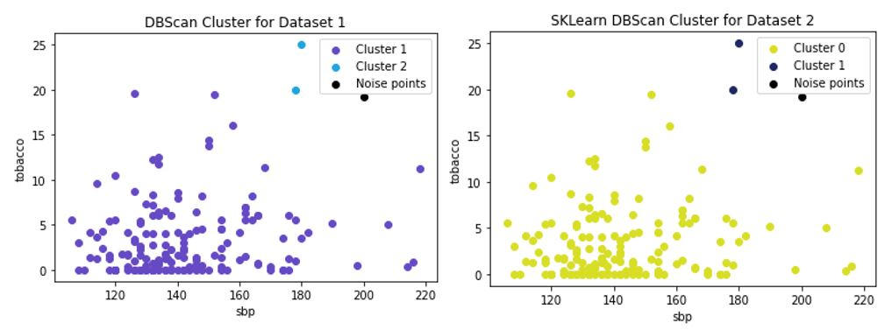
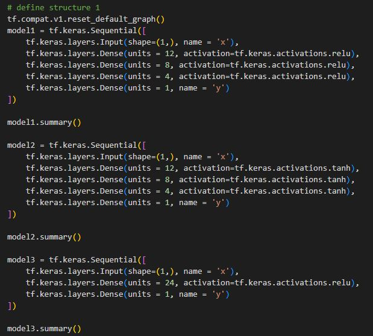
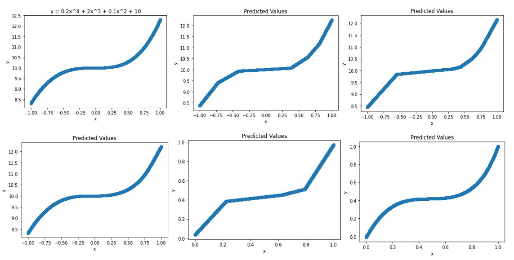

# ML-AI-projects
This is a monorepo of all the machine learning and artificial intelligence projects I implemented:

:link: [Univariate Linear Regression](https://colab.research.google.com/drive/1r9ftQFq7KBOjxpYKel36RBpa4AcPKmHo?usp=sharing) 
:link: [Logistic Regression](https://colab.research.google.com/drive/1pw4SnIS5afODQ1xexQEByaoQVogK8Fb0?usp=sharing)  
:link: [Clustering: K-Means, DBSCAN, Nearest-Neighbour](https://colab.research.google.com/drive/1ShRCx4i0MJudgj8CkVGM2hK3t8huMhX3?usp=sharing) 
:link: [Neural Network](https://colab.research.google.com/drive/1qx6hqz6geEtOo9nt5VECud7mXfud3402?usp=sharing)

## :pencil:Univariate-Linear-Regression

This is my implementation nof a simple linear regression problem. The following equations are used for the update rule:

$$\frac{\delta}{\delta {m}} = \frac{2}{{N}}\sum_{{i=1}}^{N} -{x_{i}}({y}{i}-(mx{i} + b))$$

$$m_{new}=m_{old}-\alpha\frac{\delta{E}}{\delta{m}}$$

### Results

## :pencil:Logistic-Regression

This is an implementation of logistic regression on the classic heart disease classification problem.

###
There are 10 weights associated with each feature. From the original dataset, there were 8 features, and 1 categorical feature where one-hot encoding was used to transform it into a feature. Then we add a bias to the dataset which results in the 10 features associated with the 10 weights. The following equations were used for the update rule:

$$\theta_{jnew} = \theta_{jold} + \alpha\frac{1}{m}\sum_{i=1}^{m}(y^i-\sigma(z))x^i_j;\ where \ z=\theta^Tx,\ i=row,\ j=column/feature$$

To track the loss, the Binary Crossentropy loss function is used:

$$J(\theta) = -\frac{1}{m}\sum_m^i(y^i\ log(\sigma(z))+(1-y^i)(log(1-\sigma(z))))$$

### Results
The following results show the difference in the batch and mini-batch implemented approached vs. the Scikit API

## :pencil:Clustering

I explore the introductory unsupervised learning concepts by implementing several clustering methods such as K-Means, Nearest Neighbour, and DBScan Clustering. 

###
We use the heart disease dataset to extract the **sbp** and **tobacco** features as independent and dependent variables accordingly. From there, we apply the clustering methods and compare the results with the SkLearn API.

### Results

## :pencil:Artificial Neural Network
For this project, I used Keras' Sequential API to construct different structures/models of neural networks to observe how good the model is when it comes to changing the hyperparameters. For the dataset, I take 30,000 equal steps from -1 to 1 of the following function:

$$y = 0.2x^4+2x^3+0.1x^2+10$$

Then I constructed three different neural network models:

### Results
The following results are shown in order from left to right:
1. The function/dataset
2. 3 dense layers, 1 output layer, ReLu activation function, and non-standardized input
3. 1 dense layer, 1 output layer, ReLu actiavtion function, and non-standardized input
4. 3 dense layers, 1 output layer, tanh activation function, and non-standardized input
5. 3 dense layers, 1 output layer, ReLu activation function, and standardized input
6. 3 dense layers, 1 output layer, tanh activation function, and standardized input

