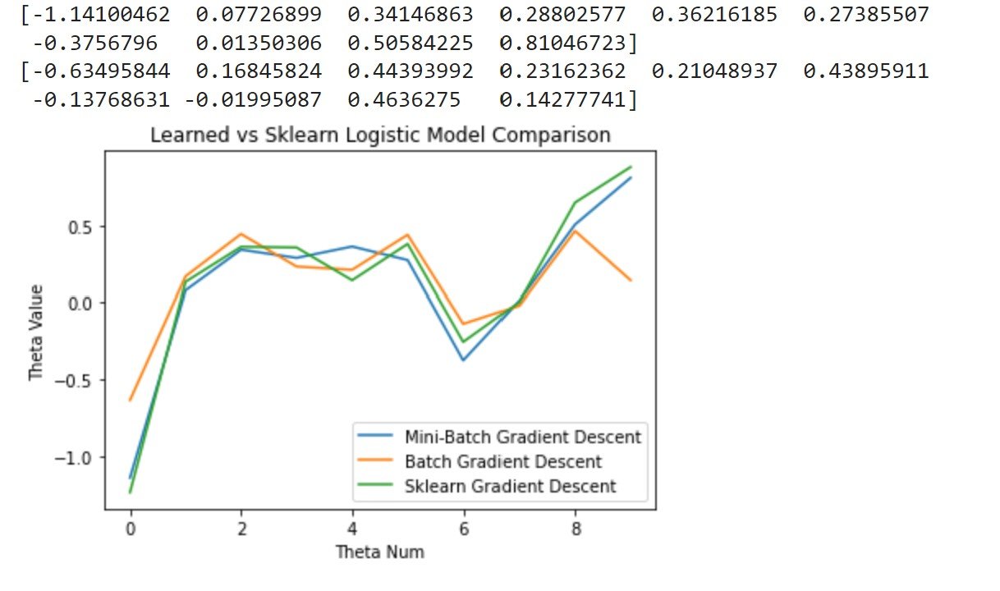

# ML-AI-projects
This is a monorepo of all the machine learning and artificial intelligence projects I implemented:

:link: [Univariate Linear Regression](https://colab.research.google.com/drive/1r9ftQFq7KBOjxpYKel36RBpa4AcPKmHo?usp=sharing) 
:link: [Logistic Regression](https://colab.research.google.com/drive/1pw4SnIS5afODQ1xexQEByaoQVogK8Fb0?usp=sharing)
:link: [Clustering: K-Means, DBSCAN, Nearest-Neighbour](https://colab.research.google.com/drive/1ShRCx4i0MJudgj8CkVGM2hK3t8huMhX3?usp=sharing)
:link: [Neural Network](https://colab.research.google.com/drive/1qx6hqz6geEtOo9nt5VECud7mXfud3402?usp=sharing)

## :pencil:Univariate-Linear-Regression

This is my implementation nof a simple linear regression problem. The following equations are used for the update rule:

$$\frac{\delta}{\delta {m}} = \frac{2}{{N}}\sum_{{i=1}}^{N} -{x_{i}}({y}{i}-(mx{i} + b))$$

$$m_{new}=m_{old}-\alpha\frac{\delta{E}}{\delta{m}}$$

### Results

## :pencil:Logistic-Regression

This is an implementation of logistic regression on the classic heart disease classification problem.

###
There are 10 weights associated with each feature. From the original dataset, there were 8 features, and 1 categorical feature where one-hot encoding was used to transform it into a feature. Then we add a bias to the dataset which results in the 10 features associated with the 10 weights. The following equations were used for the update rule:

$$\theta_{jnew} = \theta_{jold} + \alpha\frac{1}{m}\sum_{i=1}^{m}(y^i-\sigma(z))x^i_j;\ where \ z=\theta^Tx,\ i=row,\ j=column/feature$$

To track the loss, the Binary Crossentropy loss function is used:

$$J(\theta) = -\frac{1}{m}\sum_m^i(y^i\ log(\sigma(z))+(1-y^i)(log(1-\sigma(z))))$$

### Results
The following results show the difference in the batch and mini-batch implemented approached vs. the Scikit API

